# Tutorial APAP

## Authors
* **Qistina Muharrifa** - *2106708210* - *B* 

## Tutorial 7

### What I have learned today
Mempelajari dockerisasi pada project spring boot, load balancing menggunakan nginx, serta penggunaan CI/CD untuk automatic build and deploy.

### Pertanyaan
1. Apa itu Dockerfile dan docker-compose.yaml? Apa fungsinya?

      Dockerfile merupakan dokumen teks yang berisi intruksi untuk membuat image Docker. Pada Dockerfile ini memiliki perintah FROM untuk inisialisasi dan menetapkan image dasar, ARG untuk mendefisinikan argumen ke jar bacabaca, COPY untuk menyalin file JAR dari sistem host ke dalam image, EXPOSE untuk memberitahu docker bahwa container tersebut membuka port yang ditentukan dengan default TCP, dan ENTRYPOINT untuk mengaktifkan default running aplikasi java yaitu -jar /app.jar. 

      Lalu, terdapat ocker-compose.yaml yang digunakan untuk mengkonfigurasi layanan aplikasi dalam menjalankan lingkungan aplikasi multikontainer Docker.

      Referensi: https://belajarlinux.id/cara-menggunakan-Dockerfile , https://learn.microsoft.com/id-id/azure/ai-services/containers/docker-compose-recipe 

2. Screenshot hasil perubahan anda. Setelah anda menyelesaikan tutorial ini, menurut anda, mengapa kita perlu mengganti port?

      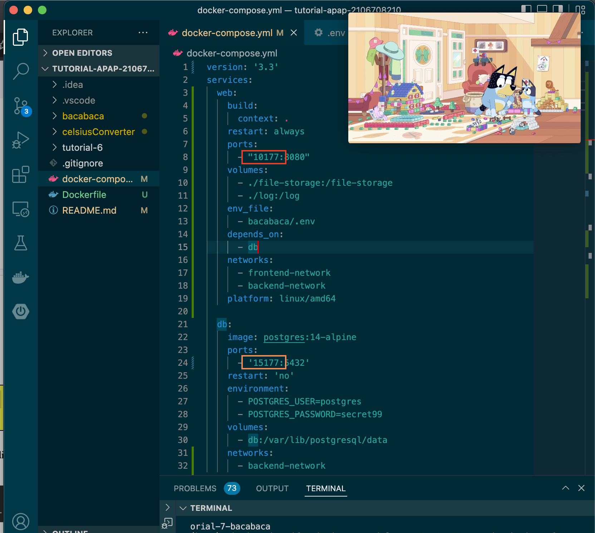

      Karena kita menggunakan kirti, sehingga banyak mahasiswa mendeploy pekerjaannya dan mereka ingin akses hasil deployan mereka ini sehingga membutuhkan port yang berbeda-beda agar tidak saling bertabrakan

3. Apa saja yang terjadi di langkah ini?

      - Modifikasi dari postgresql:15001 menjadi db:5432
      - Mengubah profiles yang digunakan menjadi dev
      - Melakukan bash gradlew build -x test
      - Docker compose di root directory

4. Sertakan screenshot container yang sedang berjalan (versi gui atau cli, pilih salah satu). Apa itu docker images, docker container, dan docker volume?

      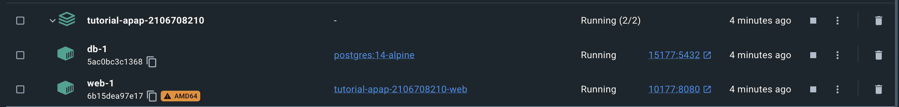
      
      `Docker images` merupakan kumpulan beberapa laipsan file yang menunjang aplikasi dalam mengeksekusi dalam wadah docker

      `Docker container` merupakan wadah untuk menjalankan aplikasi yang mencakup kode, runtime, system tools, setting.

      `Docker volume` merupakan tempat penyimpanan data yang dihasilkan dan digunakan oleh Docker container

      Referensi: https://www.niagahoster.co.id/blog/docker-tutorial/, https://firmanabdulhakim.medium.com/menghapus-docker-volume-dan-image-yang-tidak-terpakai-a3e574b35fa2

5. Apa perbedaan docker-compose down dan docker stop?

      - `docker-compose down` merupakan intruksi untuk menghentikan semua layanan yang terkait dengan konfigurasi Docker Compose. Tidak seperti stop, perintah ini juga menghapus semua container dan jaringan internal yang terkait dengan layanan
      - sedangkan `docker stop` menghentikan semua layanan yang terkait dengan konfigurasi Docker Compose, tetapi tidak menghapus container apa pun atau volume atau jaringan internal terkait.

      Referensi : https://linuxhandbook.com/docker-compose-up-start-down-stop/

6. Sertakan screenshot mengakses laman kirti milik anda melalui browser (seperti screenshot di atas) 

      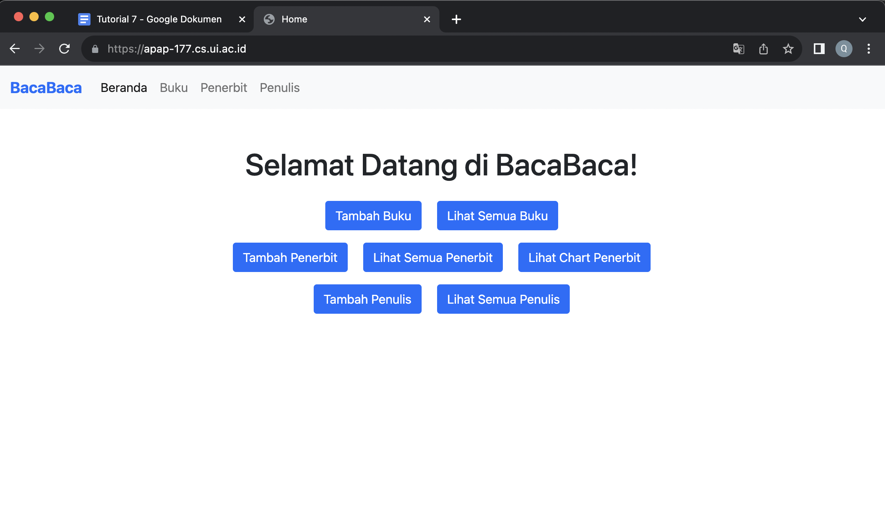
      
7. Ceritakan pengalaman anda melakukan deployment ke Kirti. Kendala apa yang anda alami?

      Saya sempat salah, menghapus folder bacabaca pada directory apap saya di kirti, sehingga harus membuat directory baru.

9.  Buka container docker Anda, lalu screenshot. Apa perbedaan tampilan container sekarang dengan tampilan container pada langkah tutorial docker di awal tadi?

      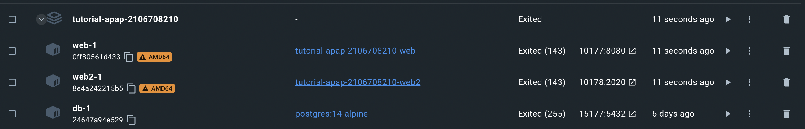

      Adanya penambahan container yang tadinya 2 menjadi 3.

10. Sertakan screenshot tampilan web ketika pertama kali menjalankan localhost:9090/port dan tampilan web ketika halaman di-refresh.

      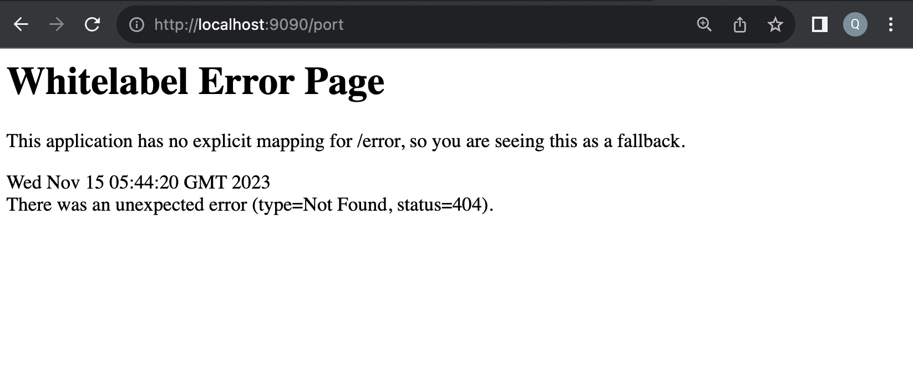

      Pada tahap ini saya mengalami kesulitan yang akan saya jelaskan pada nomor 13, sehingga tidak dapat menampilkan path tersebut.

11. Apa yang dimaksud load balancing?  Pada langkah keberapa kita mengatur konfigurasi untuk load balancing? Jelaskan blok baris yang mengatur hal tersebut.

      Load balancing adalah teknik untuk mendistribusikan lalu lintas atau beban kerja secara merata ke beberapa server atau resource untuk meningkatkan kinerja, keandalan, dan ketersediaan sistem. Blok baris yang mengatur hal ini adalah saat mengubah nginx.conf. Kita menambahkan upstream 2 port.

12. Apa yang dimaksud reverse proxy?  Pada langkah keberapa kita mengatur konfigurasi untuk reverse proxy? Jelaskan baris yang mengatur hal tersebut dan jelaskan kegunaannya dalam pengerjaan tugas kelompok nanti.

      Reverse proxy adalah server yang bertindak sebagai perantara antara klien dan server tujuan. Ini mengarahkan permintaan klien ke server, menyembunyikan rincian implementasi server dari klien. Blok baris yang mengatur hal ini saat mengubah isi nginx.conf. Di sini ada penambahan server dan location. Reverse proxy digunakan untuk menyembunyikan detail implementasi aplikasi server dari pengguna akhir dan memungkinkan pengelolaan lalu lintas, keamanan, dan caching. 

13. Kendala apa yang anda hadapi ketika melakukan tutorial bagian nginx?

      Saat mengakses path pada nomor 10, saya tidak bisa. Padahal nginx sudah berjalan yang ditandai dengan bisa mengakses localhost:9090, tetapi tetap whitelabel. Saya sudah bertanya ke teman-teman terkait hal ini, mereka menyarankan untuk build jar tetapi tetap tidak works walaupun sudah build jar/gradle 4x.

14. Apa fungsi dari SSH keys yang Anda buat dengan menggunakan ssh-keygen? Apa perbedaan antara file ~/.ssh/deployer_apap.pub dan ~/.ssh/deployer_apap ?
      
      SSH keys digunakan untuk mengamankan proses otentikasi antara server dan client. File deployer_apap.pub berisi public key yang dapat dibagikan ke server, sedangkan ~/.ssh/deployer_apap adalah private key.

15. Apa perbedaan antara GitLab repository dan GitLab runner?

      Gitlab repository merupakan tempat menyimpan pekerjaan source code dan berbagai branch dalam bentuk git, sedangkan runner digunakan untuk menjalankan CI/CD yaitu terdapat pada file .gitlab-ci.yml.

16. Apa perbedaan antara Continuous Integration, Continuous Delivery, dan Continuous Deployment?

      - Continuous Integration : agar integrasi kode teratur dan tidak konflik
      - Continuous Delivery : agar perangkat lunak dapat diproduksi dan diimplementasikan kapan saja dengan aman, mencakup  otomatisasi uji, pembuatan paket
      - Continuous Deployment : untuk memaksimalkan otomatisasi untuk mengurangi waktu dan risiko kesalahan manusia dalam proses penyebaran tanpa campur tangan manusia

17. Apa perbedaan dari stages-stages yang berada dalam file .gitlab-ci.yml?
      
      - build: melakukan kompilasi kode
      - test: melakukan test
      - build-image: bertanggung jawab untuk membangun Docker image dari kode yang dikompilasi
      - publish-image: digunakan untuk mempublikasikan Docker image ke registry Docker
      - deploy: berfokus pada implementasi atau penyebaran aplikasi ke server

18.  Pada script gitlab-ci.yml, terdapat perubahan if: $CI_COMMIT_BRANCH == 'main' menjadi if: $CI_COMMIT_BRANCH == 'feat/tutorial-7-bacabaca'. Apa fungsi dari perubahan tersebut?

      Perubahan tersebut mengubah kondisi untuk mengeksekusi langkah-langkah CI/CD hanya jika commit yang sedang di-push ada di branch feat/tutorial-7-bacabaca, bukan di branch main. Ini memungkinkan untuk menjalankan CI/CD hanya pada branch tertentu, yakni pada lab ini yaitu feat/tutorial-7-bacabaca.

19. Apa yang dimaksud dengan "docker registry"? Apa fungsinya? 

      "docker registry" merupakan layanan tempat penyimpanan dan distribusi untuk image Docker yang berfungsi sebagai enyediakan tempat sentral untuk menyimpan dan mengelola image Docker, sehingga dapat diakses oleh pengguna atau sistem lain

20.  Dalam gitlab CI/CD, apa perbedaan antara: pipeline, stage, dan job?

      - pipeline: kumpulan dari semua langkah-langkah dan tugas yang dieksekusi untuk membangun, menguji, dan menerapkan kode
      - stage: Bagian terorganisir dari pipeline, mewakili fase atau tujuan tertentu (contoh: build, test, deploy pada lab ini)
      - job: Unit eksekusi terkecil dalam GitLab CI/CD, merepresentasikan tugas atau pekerjaan spesifik dalam satu stage

21.  Sertakan screenshot fullscreen saat Anda mengakses apap-xxx.cs.ui.ac.id ketika sudah berhasil men-deploy aplikasi menggunakan CI/CD!

      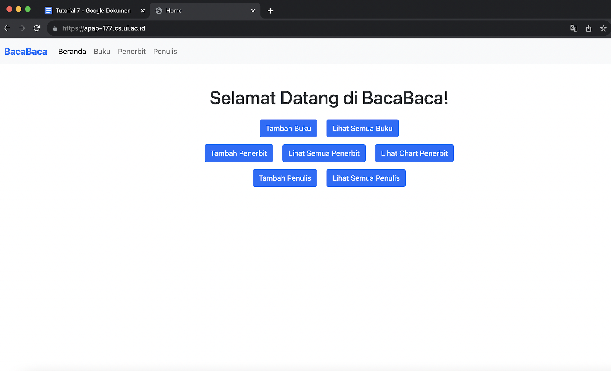

22. Kapan proses CI/CD dijalankan di GitLab?

      Proses CI/CD di GitLab dijalankan secara otomatis setiap kali ada perubahan dalam repositori, seperti push ke branch atau pembuatan pull request.

23. Mengapa CI/CD ini penting? Apa manfaatnya? 

      Dapat mendeteksi kesalahan pekerjaan yang kita buat secara cepat, selain itu terdapat pengujian otomatis, otomisasi yang cepat, serta membangun dan mendistribusikan pekerjaan kita secara konsisten.

### What I did not understand
[ ] Memahami kembali fungsi pengubahan dalam nginx.conf
[ ] Memahami alur deployment CICD lebih mendalaman

## Tutorial 6

### What I have learned today
Pada tutorial 6 ini saya belajar mengenai Git secara advance dan juga menggunakan JMeter untuk Load Testing serta melihat kinerjanya dengan JConsole.

### Pertanyaan
Advanced Git
1. Apa yang menjadi penyebab dari CONFLICT tersebut?

      Pada branch feat/tutorial-6-advancedgit-1, kita menambahkan baris pada file index.html, serta melakukan add dan commit. Lalu kita berpindah branch ke tut6-for-merge, dengan melakukan hal yang sama yaitu menambahkan baris pada file index.html, serta serta melakukan add dan commit. Dapat disimpulkan pada kedua branch, kita melakukan perubahan pada file (dan baris yang sama). Di soal, kita diperintahkan merge feat/tutorial-6-advancedgit-1 dengan tut6-for-merge yang akan menimbulkan confict karena adanya perbedaan isi pada file yang sama. Hal tersebut juga dapat di cek pada "git status" terdapat informasi pada Unmerged paths: both modified: tutorial-6/index.html sehingga jika melakukan merge akan ada conflict.

2. Jelaskan perbedaan dari "rebase –continue", "rebase –skip", dan "rebase –abort"!

      git rebase --continue: melakukan proses rebase yang digunakan ketika setelah melakukan perbaikan konflik, seperti pada rebase-1 dan rebase-2
      
      git rebase --skip: melakukan proses rebase jika tidak ada perubahan/masalah atau ingin melewati commit yang ada
      
      git rebase --abort: untuk mengembalikan kondisi ke sebelumnya atau memnatalkan proses rebase

3. Apa perbedaan Git Merge dengan Git Rebase? Buatlah/carilah ilustrasi yang dapat menggambarkan perbedaanya!

      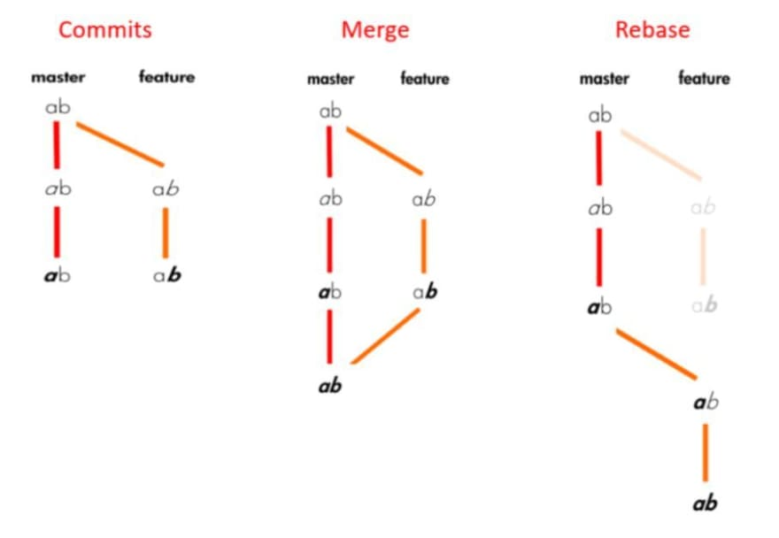

      Git Merge : Merupakan proses menggabungkan antara 2 branch seperti pada ilustrasi kita akan menggabungkan kedua ujung cabang merah dan jingga
      
      Git Rebase : Merupakan proses untuk memindahkan urutan branch ke branch lain seperti kita akan menaruh branch yang ada di berwarna jingga ke setelah branch di warna merah

4. Mengapa hal pada langkah no 4 bisa terjadi? Mengapa git stash menjadi solusinya?

      Git stash digunakan untuk menyembunyikan atau menyimpan sementara perubahan pada lokal. Pada lab, branch feature-stash-1 dengan file feature-stash.txt terdapat perubahan, jika tidak ingin melakukan commit dan ingin berpindah ke branch lain, kita dapat menggunakan git stash ini.

5. Sebutkan dan jelaskan tiga tipe dari Git Reset!

      git reset –-hard : git reset hard merupakan proses untuk melakukan undo atau mengembalikan posisi branch ke commit tertentu dengan menghapus perubahan dari stages area dan perubahan yang ada pada working directory sekarang (menghapus secara total) seperti pada lab ini
      
      git reset -–soft : git reset soft merupakan proses untuk melakukan undo atau mengembalikan posisi branch ke commit tertentu tanpa mengubah staging area dan wokring directory (hanya memindahkan branch)
      
      git reset -–mixed : git reset mixed merupakan proses untuk melakukan undo atau mengembalikan posisi branch ke commit tertentu dan mengembalikan perubahan staging area ke working directory (opsi deafult)

      Referensi : https://initialcommit.com/blog/git-reset 

6. Apa itu git revert? Apa perbedaannya dengan git reset?

      Git revert merupakan pengembalian suatu kondisi dengan membuat commit baru. Bedanya adalah, git reset akan kembali ke commit yang dituju sebelumnya, git revert akan membuat commit baru dengan kondisi yang sama dengan commit yang dituju sebelumnya.

7. Buatlah grafik yang menggambarkan alur commit pada bagian Git Flow and Branching ini serta jelaskan! Grafik dapat berupa tulis tangan maupun menggunakan software.

      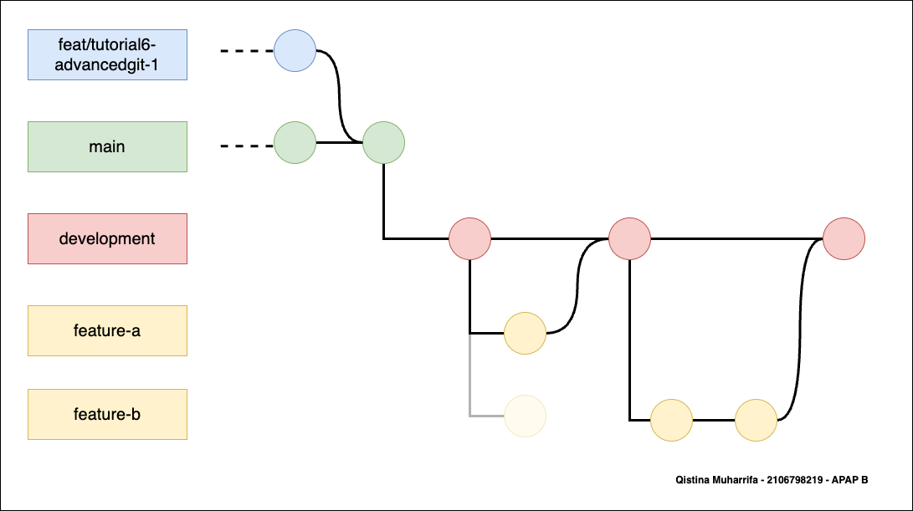

      Terdapat 5 branch pada bagian ini, berikut adalah penjelasan alurnya di mana alur dari kiri ke kanan:
      1. Melakukan merge dari feat/tutorial-6-advancedgit-1 ke branch main (membentuk commit baru di main)
      2. Membuat branch development dari branch main dan berpindah ke branch tersebut tanpa membuat commit
      3. Membuat folder dan file dan membuat commit (menjadi ada 1 commit di development)
      4. Pertama, membuat branch baru feature-a berdasarkan branch development dan berpindah ke branch tersebut tanpa membuat commit
      5. Terdapat pengerjaan pada sebuah file sehingga melakukan commit kembali (terdapat 1 commit di feature-a) 
      6. Melakukan merge dari feature-a ke development (membentuk commit di development)
      7. Kedua, membuat branch baru feature-b berdasarkan branh development (di sini feature-b dibuat bersamaan dengan feature-a. lalu, berpindah ke branch tersebut tanpa membuat commit)
      8. Terdapat pengerjaan pada sebuah file sehingga melakukan commit kembali (terdapat 1 commit di feature-b)
      9. Karena ada commit terbaru dari development dengan feature-a, pada feature-b melakukan rebase (ditandai dengan flow yang opacity-nya rendah, pindah ke commit baru pada development)
      10. Setelah melakukan perubahan atas konflik, melakukan commit kembali pada feature-b (commit di feature-b menjadi 2)
      11. Melakukan merge dari feature-b ke development (membentuk commit di development)
      12. Selesai :)

Jmeter & Jconsole

8. Apa kegunaan dari langkah di atas?

      Pada tahap ini, kita membuat HTTP Header Manager di dalam Thread Group yang berada pada Test Plan sehingga:

      Test Plan : Serangkaian langkah yang akan dijalankan JMeter saat dijalankan yang pada lab ini terdiri dari 1 Thread Group
      
      Thread Group : Tempat untuk controller, sampler, listener, dll untuk mengontrol jumlah user virtual(thread) dan lainnya yang akan digunakan JMeter untuk menjalankan test. 
      
      HTTP Header Manager : Digunakan untuk komponen konfigurasi yaitu, header kustom dengan menyesuaikan informasi apa yang dikirimkan JMeter di header  HTTP request yang berada pad Thread Group

      Referensi : https://www.blazemeter.com/blog/jmeter-tutorial

9. Apa itu JSON Extractor? Sebutkan semua kegunaannya di Test Plan ini!

      JSON Extractor digunakan untuk ekstrak data dari respon JSON yang diterima dari server web dan akan disimpan pada variabel JMeter ini. Pada Test Plan ini, kita menggunakan JSON Extractor pada create buku karena di sini ada proses POST atau memasukan ke dalam database kita sehingga butuh menyamakan format data yaitu JSON. Di sini, terdapat idBuku sebagai Names of Created Variable (yang akan digunakan pada update) dan ada JSON Path Expression ialah variabel yang diekstrak dari JSON nya yaitu $.id ke dalam idBuku.

11. Apa itu Number of Threads dan Ramp-up Period? Apa hubungan antar keduanya?

      Number of Threads : Jumlah user virtual yang ingin disimulasi
      
      Ramp-Up Period : Lama waktu tunda antar user untuk mulai

      Hubungan keduanya adalah jika kita memasukkan Periode Ramp-Up selama 5 detik, JMeter akan menyelesaikan permulaan semua thread (user) pada akhir 5 detik tersebut. Jadi, jika kita memiliki 5 pengguna dan Periode Ramp-Up 5 detik, maka jeda antar pengguna awal adalah 1 detik (5 pengguna / 5 detik = 1 pengguna per detik)

      Sumber : https://jmeter.apache.org/usermanual/build-web-test-plan.html

12. Gunakan angka 1000 untuk Number of Threads dan 100 untuk Ramp-up period. Jalankan Test Plan dengan konfigurasi tersebut. Kemudian, perhatikan Summary Report, View Result Tree, Graph Result, dan Assertion Result. Buatlah penjelasan minimal 2 paragraf untuk menjelaskan temuan menarik kalian terhadap hasil-hasil tersebut. Sertakan screenshot dari keempat result tersebut. Sertakan juga info mengenai prosesor, RAM, dan penggunaan hardisk HDD atau SSD dari perangkat Anda. (Jika perangkat Anda tidak kuat dengan angka konfigurasi tersebut, silakan turunkan angkanya.)

      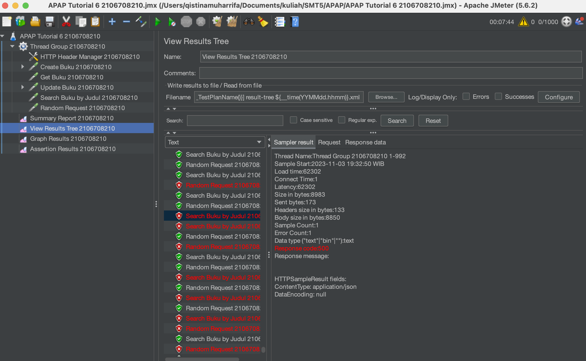

      Temuan menarik pertama yang saya lihat adalah pada View Result Tree. Di sini terdapat kegagalan pada search buku. Search buku tidak dapat adanya null yang disebabkan adanya internal server error 500.

      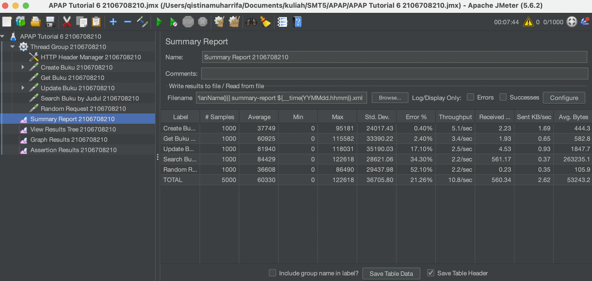

      Pada bagian ini saya menemukan hal menarik. Hal menarik terseburt berada pada Random Request di mana error sangat besar jauh dibandingkan dengan yang lain. Hal ini disebabkan karena judulnya sendiri, yaitu permintaan acak sehingga tidak dapat diperkirakan kalau error akan lebih kecil, karena benar-benar random :).

      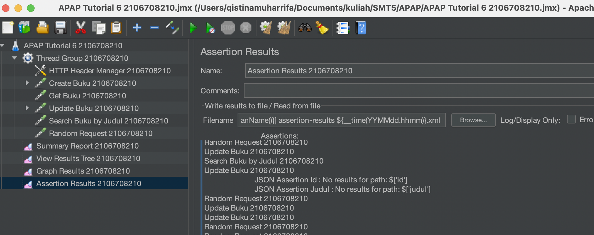

      Temuan menarik pertama yang saya lihat adalah pada Assertion Result. Pada bagian ini terdapat kegagalan pada Update Buku. Di dalamnya memunculkan pesan bahwa tidak terdapat path id dan judul. Hal ini bisa saja karena adanya internal server error di mana tidak ada field id dan judul pada JSON Response nya sehingga tidak tertangkap, seperti pada bagian view result tree.

      Berikut saya juga tampilkan Graph Resultnya.
      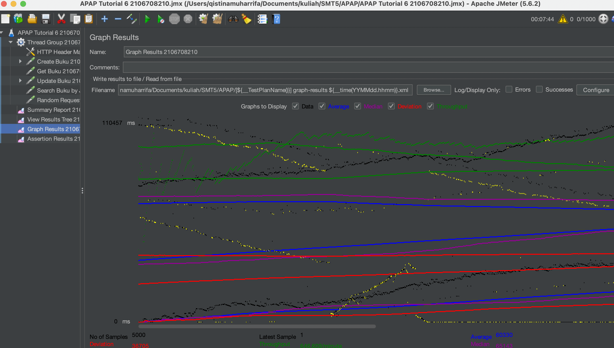

      Informasi perangkat:
      - RAM       : 8 GB
      - SSD       : 512 GB
      - Processor : M1

13. Sembari menjalankan Test Plan, perhatikan pergerakan grafik pada JConsole. Buatlah penjelasan minimal 2 paragraf untuk menjelaskan temuan menarik kalian terhadap hasil-hasil tersebut. Sertakan screenshot dari grafik-grafik tersebut.

      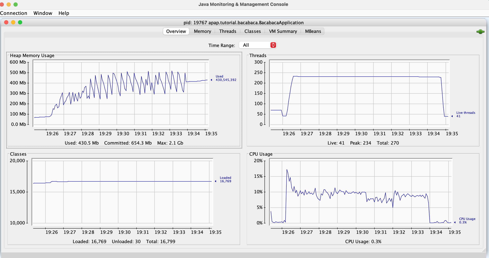

      Pada JConsole, terdapat empat grafik. Empat grafik tersebut adalah Heap Memory Usage, Threads, Classes, dan CPU Usage. Saat melakukan run, terlihat grafik Heap Memory Usage dan CPU Usage mengalami kenaikan yang signifikan pada startnya dan terus berubah. Hal ini menarik, dengan terlihat bahwa terdapat sekitar 500 Mb memory yang digunakan paling tingi saat terus berjalan dan penggunaan sekitar 17% penggunaan CPU tertinggi pada saat mulai berjalan.

      Lalu untuk grafik selanjutnya adalah Clases dan Threads. Untuk Classes menunjukan tidak terlalu banyak perbedaan dari awal hingga akhir. Namun untuk Threads, terdapat hal menarik, yakni adanya peak yang muncul saat mulai run. Menunjukan bahwa penggunaan yang besar di awal.

14. Apa itu Load Testing? Buatlah kesimpulan dari pengerjaan tutorial JMeter & JConsole ini.

      Load testing adalah jenis tes kinerja yang digunakan untuk mengevaluasi bagaimana sistem atau aplikasi akan merespons ketika dibebani dengan tingkat permintaan yang tinggi. Pada lab ini, kita menggunakan JMeter dan JConsole. JMeter digunakan untuk alat pengujian beban load testing, sedangkan JConsole digunakan untuk melihat bagaimana kinerja sumber daya kita atau melihat manajemen kinerjanya.

### What I did not understand
- [x] Membiasakan diri menggunakan Spring Boot Framework
- [x] Kenapa saya harus belajar APAP? (Dijawab pada Tutorial 1)
- [x] Memahami lebih lanjut mengenai konsep MVC serta DI
- [x] Mengapa perlu transfer data dengan konsep DTO?
      Baik digunakan dalam validasi data, mendukung mekanisme layer, dan tidak mengakses db secara langsung sehingga lebih aman
- [ ] Memahami lebih dalam penggunaan annotation setiap atribut dalam table
- [ ] Memahami penggunaan Maven, Gradle, dan lainnya serta best practice implementasi dalam pengembangan aplikasi
- [ ] Memahami penggunaan mono
- [x] Perbedaan service producer dan consumer

      Service producer adalah entitas yang membuat dan menyediakan layanan atau sumber daya, sementara service consumer adalah entitas yang menggunakan atau mengakses layanan atau sumber daya tersebut. Producer menghasilkan atau menyediakan informasi atau layanan, sedangkan consumer mengonsumsi atau memanfaatkan informasi atau layanan tersebut.
- [ ] Mengapa saat run di Jmeter tidak berurut
- [ ] Memahami lebih dalam mengenai JConsole

## Tutorial 5
### What I have learned today
Pada tutorial 5 ini, saya mempelajari penggunaan Postman, webservice, dan mockserver. Lalu, saya mempelajari penggunaan method-method yang tersedia tersebut.

### Pertanyaan
1. Apa itu Postman? Apa kegunaannya?
      
      Postman merupakan API platform untuk mengembangkan, mengetes, dan mengubah API yang biasa digunakan oleh app developer. Postman ini menyediakan environment untuk mengirim dan menerima requestHTTP ke dan dari API, testing, dokumentasi API dan lain-lain. Kegunaan lainnya ialah bisa digunakan untuk melakukan kolaborasi, monitoring API, serta melalukan simulasi environment.

      Referensi : https://www.geeksforgeeks.org/introduction-postman-api-development/ 

2. Apa yang terjadi ketika kita tidak menggunakan @JsonIgnoreProperties dan @JsonProperty pada model Buku dan Penulis? apabila terjadi error, mengapa hal tersebut dapat terjadi?

      `@JsonIgnoreProperties` merupakan anotasi yang digunakan untuk menandai properti yang diabaikan Jackson dan `@JsonProperty` merupakan anotasi yang digunakan untuk me-mapping object Java ke JSON dan sebaliknya sehingga kita dapat menggunakan setter, getter dan sebagainya dalam membuat serialisasi/deserialisasi. Jika kita tidak menggunakan kedua anotasi tersebut, akan terjadi errpr seperti serialization error dan deserialization error, di mana properti dalam model atau JSON dan mencocokannya ke dalam JSON atau model dan jika tidak ada maka dapat mengakibatkan ketidaksesuaian hasil. Selain itu, dapat menyebabkan properti yang hilang atau tidak sesuai, dan JSON yang tidak valid.

      Referensi : https://www.baeldung.com/jackson-annotations
      
3. Pada tutorial ini, kita mencoba untuk memanggil data dengan menggunakan method GET. Namun, apakah kita dapat memanggil data dengan method lainya, seperti POST? Jelaskan pendapat kalian?

      Jika kita ingin memanggil data dengan menggunakan method seperti POST, kita tetap dapat megambil data tersebut. Hal tersebut juga dipicu oleh beberapa alasan, seperti keamanan informasi, panjang url yang pendek, dan melihat hasil interaksi dari pengembangan web. Walaupun, penggunaan POST untuk operasi baca (read) biasanya dianggap sebagai praktik yang tidak konvensional dan bisa membuat pengembangan dan pemahaman API Anda menjadi lebih rumit.

      Referensi : https://medium.com/swlh/why-would-you-use-post-instead-of-get-for-a-read-operation-381e4bdf3b9a 

4. Selain method GET dan POST, sebutkan dan jelaskan secara singkat HTTP request methods lainnya yang dapat kita gunakan!

      Pada Lab ini kita juga mempelajari PUT dan DELETE
- PUT digunakan untuk update, yaitu mengirimkan data ke server untuk mengganti atau memperbarui data pada server.
- DELETE digunakan untuk menghapus data yang telah dilokasikan pada server

5. Apa kegunaan atribut WebClient?

      WebClient adalah sebuah antarmuka (interface) dalam framework Spring yang digunakan sebagai titik masuk utama untuk melakukan permintaan (requests) ke sumber daya web, seperti RESTful API atau layanan web lainnya. Kegunaannya antara lain mengirim request HTTP, reactiivty, serta pengganti RestTemplate.
      
      Referensi : https://www.baeldung.com/spring-5-webclient#:~:text=Simply%20put%2C%20WebClient%20is%20an,classic%20RestTemplate%20in%20these%20scenarios.

### What I did not understand
- [x] Membiasakan diri menggunakan Spring Boot Framework
- [x] Kenapa saya harus belajar APAP? (Dijawab pada Tutorial 1)
- [x] Memahami lebih lanjut mengenai konsep MVC serta DI
- [x] Mengapa perlu transfer data dengan konsep DTO?
      Baik digunakan dalam validasi data, mendukung mekanisme layer, dan tidak mengakses db secara langsung sehingga lebih aman
- [ ] Memahami lebih dalam penggunaan annotation setiap atribut dalam table
- [ ] Memahami penggunaan Maven, Gradle, dan lainnya serta best practice implementasi dalam pengembangan aplikasi
- [ ] Memahami penggunaan mono
- [x] Perbedaan service producer dan consumer

      Service producer adalah entitas yang membuat dan menyediakan layanan atau sumber daya, sementara service consumer adalah entitas yang menggunakan atau mengakses layanan atau sumber daya tersebut. Producer menghasilkan atau menyediakan informasi atau layanan, sedangkan consumer mengonsumsi atau memanfaatkan informasi atau layanan tersebut.

## Tutorial 4
### What I have learned today
Pada lab 4 ini saya mempelajari bagian Presentation Layer, error handling dengan memanfaatkanSpring Profiles, mempelajari penggunaan static files, serta memahami jenis deployment environment pada setiap tahap pengembangan perangkat lunak

### Pertanyaan
1. Pada file html project bacabaca, terdapat baris kode berikut. Apa itu xmlns? Jawab dengan singkat dan padat.
      
      `<html lang="en" xmlns="http://www.w3.org/1999/xhtml" xmlns:th="http:/ thymeleaf.org">` 

      xmlns atau XML Namespace merupakan atribut atau nama elemen yang menentukan namespace dokumen xml.

2. Jelaskan perbedaan th:include dan th:replace! Jawab dengan singkat dan padat.

      `th:include` = atribut Thymelead yang digunakan memasukkan konten dari elemen template ke dalam elemen target di dalam dokumen HTML.
      `th:replace` = atribut Thymelead yang digunakan untuk menggantikan elemen target di dalam dokumen HTML dengan konten dari elemen template.

3. Kapan sebaiknya kita menggunakan static files dibandingkan dengan file eksternal menggunakan link?  Jawab dengan singkat dan padat.
      
      `static files` baik digunakan ketiika digunakan berulang kali di banyak halaman, statis, dan ingin disimpan dalam cache lebih sering.

4. Jelaskan caramu menyelesaikan latihan no 2.

      Dalam mengerjakan nomor 2, ialah mirip dengan panduan, tetapi pada saat melakukan update buku. Caranya ialah menambahkan List<Penulis> listPenulis ke dalam DTO UpdateBukuRequestDTO, setelah itu pada PenulisController, menambahkan function yang serupa dengan addRowPenulisBuku dan deleteRowPeulisBuku namun memanfaatkan UpdateBukuRequestDTO dan merender page yang berkaitan dengan update. Selain itu, adanya perubahan pada html di mana harus mengiterate row penulis di mana serupa dengan panduan.

5. Jelaskan apa itu pagination! Jawab dengan singkat dan padat.

      `pagination` adalah tag pada script js seperti pada lab ini yang digunakan untuk memecah konten dalam beberapa halaman. 

6. Sebutkan salah satu skenario yang mengharuskan adanya perbedaan dev dan prod dan jelaskan alasannya!

      Penggunaan database merupakan salah satu skenario yang mengharuskan penggunaan dev dan prod dalam pengembangan aplikasi. Misal saat sedang development, kita sebaiknya menggunakan dummy data agar tidak mengganggu data asli dan menjaga keamanannya.

7. Lampirkan screenshot kalau kamu sudah berhasil membuat user untuk environment production serta bukti bahwa kamu sudah berhasil mengakses database production dengan user tersebut!
- Membuat User Prod

- Mengakses database prod menggunakan user tsb

### What I did not understand
- [x] Membiasakan diri menggunakan Spring Boot Framework
- [x] Kenapa saya harus belajar APAP? (Dijawab pada Tutorial 1)
- [x] Memahami lebih lanjut mengenai konsep MVC serta DI
- [x] Mengapa perlu transfer data dengan konsep DTO?
      Baik digunakan dalam validasi data, mendukung mekanisme layer, dan tidak mengakses db secara langsung sehingga lebih aman
- [ ] Memahami lebih dalam penggunaan annotation setiap atribut dalam table
- [ ] Memahami penggunaan Maven, Gradle, dan lainnya serta best practice implementasi dalam pengembangan aplikasi

Referensi bonus latihan: 
https://github.com/eugenp/tutorials/tree/master/spring-boot-modules/spring-boot-basic-customization

## Tutorial 3
### What I have learned today
Pada lab 3 ini saya mempelajari penggunaan Docker, Relasi database pada project Spring boot dengan penggunaan mapper dan annotation.

### Pertanyaan
1. Jelaskan apa itu **ORM** pada spring serta apa fungsi dan kegunaanya?

      **ORM (Object Relational Mapping)** adalah teknik yang mengubah tabel *database* menjadi objek sehingga memudahkan penggunaannya. Objek yang dihasilkan memiliki properti yang sesuai dengan kolom-kolom dalam tabel tersebut. ORM memungkinkan pengguna untuk melakukan *query* dan manipulasi data dalam *database* dengan paradigma pemrograman berorientasi objek, mengatasi masalah kesalahan dalam penulisan *query* *database*. Meskipun bisa bekerja tanpa ORM dengan pemahaman yang baik tentang kueri *database*, ORM menawarkan banyak keunggulan seperti fitur transaksi, pengelolaan koneksi, migrasi data, dan abstraksi akses data, yang membuatnya menjadi pilihan populer dalam pengembangan perangkat lunak.

      Referensi : https://medium.com/wripolinema/sudah-kenal-sama-orm-34712e85c6fa

2. Jelaskan secara singkat apa itu dan kegunaan dari tag-tag dibawah ini.

      (@Entity, @Table, @Column)

      `@Entity` merupakan anotasi yang digunakan untuk mengidentifikasi sebuah kelas sebagai kelas entitas dalam JPA. Kelas yang dianotasi dengan @Entity akan dianggap dan digunakan sebagai representasi dari tabel dalam basis data relasional.

      `@Table` merupakan anotasi yang digunakan untuk menyesuaikan pemetaan tabel dalam basis data. Kita dapat menggunakan atribut *name* untuk mengubah nama tabel yang akan digunakan oleh entitas tersebut. Kita juga dapat mengatur *atribut schema* dan katalog untuk menentukan skema dan katalog basis data yang sesuai.

      `@Column` merupakan anotasi yang digunakan untuk menyesuaikan pemetaan kolom dalam tabel. Kita dapat menggunakannya untuk mengubah nama kolom yang sesuai dengan atribut entitas, mengatur apakah kolom tersebut dapat diubah atau dimasukkan, dan menentukan berbagai properti lain seperti jenis data, panjang, skala, presisi, dan keunikan kolom.

      Dengan menggunakan ketiga anotasi ini, kita dapat mengonfigurasi  entitas Java kita ke tabel dalam basis data relasional, termasuk mengubah nama tabel, kolom, dan atribut lainnya sesuai dengan kebutuhan aplikasi.

      Referensi : https://thorben-janssen.com/key-jpa-hibernate-annotations/#define-an-entity-class

3. Pada relasi buku ke penulis, terdapat tag 

      **@JoinTable(name = "penulis_buku", joinColumns = @JoinColumn(name = "id"),inverseJoinColumns = @JoinColumn(name = "id_penulis"))**

      Jelaskan maksud dari tag @JoinTable tersebut beserta parameternya (name, joinColumns, inverseJoinColumns) dan implementasinya pada database. 

      @JoinTable digunakan dalam relasi many-to-many antara entity buku dan entity penulis dan menjelaskan adanya sebuah tabel gabungan (join table) yang mengelola hubungan antara buku dan penulis dalam database. Dalam database, akan menghasilkan tabel gabungan "penulis_buku" dengan dua kolom foreign key, yaitu "id" yang merujuk ke id buku dan "id_penulis" yang merujuk ke id penulis

      `name = "penulis_buku"` merupakan parameter name yang menentukan nama tabel gabungan yang akan dibuat dalam database. Dalam hal ini, tabel tersebut akan dinamai "penulis_buku."

      `joinColumns = @JoinColumn(name = "id")` merupakan parameter yang digunakan untuk menentukan kolom-kolom yang merupakan foreign key dari entity yang memiliki anotasi @JoinTable, yaitu buku. Dalam hal ini, ada satu kolom yang digunakan sebagai foreign key, yaitu "id," yang merujuk ke id buku dalam tabel gabungan.

      `inverseJoinColumns = @JoinColumn(name = "id_penulis")`  merupakan parameter yang digunakan untuk menentukan kolom-kolom yang merupakan foreign key dari entity lain yang terlibat dalam relasi, yaitu penulis. Dalam hal ini, ada satu kolom yang digunakan sebagai foreign key, yaitu "id_penulis," yang merujuk ke id penulis dalam tabel gabungan.

      Referensi : https://www.javaguides.net/2023/07/jpa-jointable-annotation.html

4. Bagaimana cara kerja dari dependensi java mapper, yaitu mapstruct?

      MapStruct merupakan sebuah code generator yang digunakan dalam proyek Java untuk menyederhanakan implementasi pemetaan antara jenis bean Java berdasarkan pendekatan konvensi daripada konfigurasi. Cara kerjanya adalah dengan menghasilkan kode pemetaan secara otomatis pada saat kompilasi, menggunakan metode biasa, sehingga memberikan kecepatan, keamanan tipe data, dan kemudahan pemahaman. MapStruct digunakan sebagai prosesor anotasi yang diintegrasikan dengan kompiler Java, baik dalam proses kompilasi melalui command-line builds (seperti Maven atau Gradle) maupun dari dalam lingkungan pengembangan terpadu (IDE) yang preferensi penggunanya. Mapstruct memberikan kemudahan penggunaan dengan default yang masuk akal, namun juga memberikan fleksibilitas untuk mengkonfigurasi atau mengimplementasikan perilaku khusus jika diperlukan.

      Referensi : https://mapstruct.org/

5. Apa keuntungan dari implementasi soft delete?

      Keuntungan utama dari implementasi soft delete adalah mencegah kehilangan data secara permanen. Dalam sistem dengan soft delete, data yang dihapus hanya ditandai sebagai "dihapus" tanpa benar-benar menghapusnya dari database. Hal ini memungkinkan untuk memulihkan data yang dihapus jika dibutuhkan dan dapat meningkatkan transparansi dan keamanan data dalam aplikasi.

      Referensi : https://www.dolthub.com/blog/2022-11-03-soft-deletes/

### What I did not understand
- [x] Membiasakan diri menggunakan Spring Boot Framework
- [x] Kenapa saya harus belajar APAP? (Dijawab pada Tutorial 1)
- [ ] Memahami lebih lanjut mengenai konsep MVC serta DI
- [ ] Mengapa perlu transfer data dengan konsep DTO?
- [ ] Memahami penggunaan Maven, Gradle, dan lainnya serta best practice implementasi dalam pengembangan aplikasi

## Tutorial 2

### What I have learned today
Pada tutorial ini, saya belajar menggunakan Gradle, menggunakan konsep MVC dengan prinsip DI (menggunakan AutoWired) dan DTO, melakukan mapping pada controller dan Thymeleaf.

### Pertanyaan
1. Apa itu DTO? Jelaskan kegunaannya pada proyek ini?
      
      DTO atau Data Transfer Object merupakan objek yang membawa data antar proses sehingga hanya berisi data saja (tidak ada business logic). Pada tugas ini, saya menggunakan BukuDTO sebagai "kurir" dalam melakukan create serta melakukan update objek Buku. BukuDTO dibuat dalam formAddBuku dan formUpdateBuku yang dilakukan oleh request method GET. Setelah field terisi dan tersubmit, akan terdapat method POST yang digunakan controller mengambil value dari field sehingga data dapat dimasukan ke dalam object Book.

      Referensi: https://www.okta.com/identity-101/dto/ 

2. Apa itu UUID? Mengapa UUID digunakan?
      
      UUID atau Universally Unique Identifier ialah notasi heksa desimal menggunakan 36 karakter 128 bit yang di-generate dan dipisahkan oleh 4 garis strip. UUID ini termasuk ke dalam immutable class. UUID digunakan untuk memetakan (sebagai ID) yang unik di setiap objek sehingga setiap objek memiliki penanda yang berbeda. Berbeda dengan membuat ID manua, dengan menggunakan UUID karena secara otomatis akan unik di sisi server serta tidak mengandung informasi yang merepresentasikan objeknya sehingga aman digunakan.

      Referensi : https://medium.com/teads-engineering/generating-uuids-at-scale-on-the-web-2877f529d2a2  

3. Pada service, mengapa perlu ada pemisahan antara interface dan implementasinya?
      
      Pemisahan antara interface dan implementasinya pada lab ini bisa dikatakan sebagai bagian dari IoC (Inversion of Control) dan DI (Dependency Injection. Hal ini dilakukan agar kita mengganti-ganti code yang (yang di implementasi interface) tanpa harus merubah kode yang sedang digunakan (sehingga menggunakan override). Pada lab ini, kita dapat merubah-rubah BukuServiceImpl (membuat implement yang berbeda) tanpa mengubah bagian aplikasi yang lain.

      Referensi : Slides Week 3

4. Menurut kamu anotasi @Autowired pada class Controller tersebut merupakan implementasi dari konsep apa? Dan jelaskan secara singkat cara kerja @Autowired tersebut dalam konteks service dan controller yang telah kamu buat.
      
      Pertanyaan ini berkaitan dengan pertanyaan sebelumnya, @AutoWired ini merupakan konsep dari DI. @Autowired ini digunakan pada BukuController, yang mana berada pada objek bukuService. Hal tersebut menandakan adanya DI dari Controller dan Service. Fungsinya ialah Spring akan menyediakan objek bukuService untuk Controller dan juga penggunaan dalam implementasi untuk interface service seperti pada nomor sebelumnya.

5. Apa perbedaan @GetMapping dan @PostMapping?
      
      @GetMapping dan @PostMapping merupakan anotasi yang digunakan untuk mengatur method GET dan POST, seperti yang kita sering gunakan pada mata kuliah PBP. HTTP GET request digunakan untuk mendapatkan beberapa value dari HTML (serverside) lalu anotasi @GetMapping akan memetakan request tersebut ke dalam suatu penanganan request itu. Sebaliknya, @PostMapping digunakan untuk mengirim value yang ada pada HTTP POST request lalu @PostMapping akan memetakan request tersebut ke suatu penanganannya di mana hal ini memungkinkan kita untuk melakukan create dan update seperti pada tutorial ini.

      Referensi : https://www.javaguides.net/2018/11/spring-getmapping-postmapping-putmapping-deletemapping-patchmapping.html 

6. Jelaskan proses yang terjadi di controller, model, dan service pada proses create buku, mulai dari fungsi formAddBuku hingga pengguna menerima halaman success-create-buku.
      
      Secara singkat, controller merupakan penghandlean path dan memanggil kebutuhan yang ada di service, model merupakan class objectnya, serta service yang berisi business logicnya. Berikut adalah langkah-langkahnya:
- Sebelumnya, kita sudah membuat objek Buku, Controller, dan Servicenya
- Setelah menjalankan lokal, kita arahkan ke Tambahkan Buku
- Pada saat ini, controller menerima request GET yang akan diarahkan oleh formAddbuku. formAddBuku memanfaatkan DTO dalam mentransfer data
- Pada sat ini juga memunculkan halaman form-create-buku. Terdapat object bukuDTO sebagai penghubung antara form dan object
- Setelah kita mengisi dan submit, adanya pemanggilan addBuku karena adanya method POST. 
- Dalam addBuku terdapat validasi judul. Jika judul sudah ada, maka akan menampilkan halaman fail-create-update-buku
- Jika tidak terjadi masalah, kita akan mengambil value-value yang ada pada bukuDTO. Hal ini dikarenakan pada addBuku terdapat @ModelAttribute BukuDTO bukuDTO
- Dari bukuDTO tersebut, kita membuat objek buku baru dan memanggil service yaitu createBuku ke dalam bukuService
- Karena bukuService yang @Autowired (memanfaatkan DI), createBuku akan terpanggil dalam bukuService yang dioverride pada BukuServiceImpl
- Setelah createBuku berhasil, kita menambahkan model.addAttribute untuk dirender di thymeleaf
- Pada akhirnya kita diarahkan ke success-create-buku dan menampilkan pesan berhasil. 

7. Jelaskan mengenai th:object!
      
      th:object merupakan penggunaan Thymeleaf dalam pengaitan atribut objek. Misal kan pada form-create-buku terdapat th:object="${bukuDTO} di mana setiap input yang masuk akan dibuat menjadi objek bukuDTO. Di sini, setiap field diberi th:field="*{namaatribut} untuk menghubungkan setiap value ke dalam object bukuDTO. Dengan adanya th:object ini, kita bisa memproses, menampilkan, hingga menyimpan dalam tampilan HTML.

8. Jelaskan mengenai th:field!
      
      th:field merupakan penggunaan Thymeleaf dalam membuat form input yang akan dimasukan ke dalam object seperti yang ada pada nomor 7. Ketika pengguna menekan submit, field ini akan memasukan nilainya ke dalam atribut-atribut objek yang menggunakan Thymeleaf.

TIPS: Buka “view page source” dari halaman Tambah Buku di browser. Lakukan screenshot kemudian jelaskan temuan kalian.

Pada temuan saya, saat view page source tidak terdapat tag yang mengandung th. Selain itu, th:field juga membuat di page source menjadi id, name, dan value.

### What I did not understand
- [ ] Membiasakan diri menggunakan Spring Boot Framework
- [x] Kenapa saya harus belajar APAP? (Dijawab pada Tutorial 1)
- [ ] Memahami lebih lanjut mengenai konsep MVC serta DI
- [ ] Mengapa perlu transfer data dengan konsep DTO?
- [ ] Memahami penggunaan Maven, Gradle, dan lainnya serta best practice implementasi dalam pengembangan aplikasi

## Tutorial 1
### What I have learned today
Pada lab ini saya mempelajari caraa penggunaan git secara advanced, hal-hal yang dapat dilakukan di Gitlab (membuat issues, development, dan merge request), membuat web CelsiusConverter dengan menggunakan framework Spring Boot, serta penggunaan model dan controller pada app.

### GitLab
1. [Note] Apa itu Issue? Apa saja masalah yang dapat diselesaikan dengan fitur Issue?
      
      Pada lab ini, kita membuat issue yang dapat digunakan untuk mencatat masalah yang terjadi. Menurut docs Gitlab, Issue merupakan salah satu fitur pada kontrol sistem. Pembuatan Issue ini bisa digunakan untuk memecahkan masalah dan merencanakan pekerjaan selanjutnya. Issue ini juga bisa dibagikan dengan tim dan external kolaborator. 

      Manfaat dalam pembuatan issue dalam penyelesaian masalah antara lain: menjelaskan implementasi dari ide pekerjaan, track status pekerjaan kita dengan mudah, elaborate implementasi kode. Selain itu, Issue ini juga dapat menyetujui proposal fitur permintaan, support request, serta bug reports.

      Referensi : https://docs.gitlab.com/ee/user/project/issues/

2. [Note] Apa perbedaan dari git merge dan git merge --squash? 
      
      Perbedaan utama dari git merge dan git merge --squash adalah bagaimana perubahan dari source branch dimasukkan ke dalam source target dalam Git. 

      git merge (tanpa squash) merupakan perintah untuk menggabungkan branch-branch kode menjadi satu code base saja. Kelebihan dengan menggunakan perintah ini adalah pengembangan fitur dapat dilakukan tanpa mengganggu jalannya aplikasi pada main. 

      git merge --squash sendiri merupakan perintah untuk menggabungkan branch-branch kode yang berurutan menjadi commit yang tunggal. Di mana saat melakukan git merge biasa, terdapat hasil commit tambahan sehingga kita bisa menambahkan --squash ini untuk melakukan merge dengan membuat working tree dan index state. 

      Referensi : https://betterprogramming.pub

3. [Note] Apa keunggulan menggunakan Version Control System seperti Git dalam pengembangan suatu aplikasi?
      
      Version Control System sendiri merupakan sistem yang merekam perubahan pekerjaan kita dari waktu ke waktu sehingga memungkinkan kita untuk mengembalikan pekerjaan kita ke stage sebelumnya, contohnya adalah Git. Maka dari itu, Version Control System ini memiliki banyak sekali keunggulan jika kita ingin mengembangkan suatu aplikasi, yaitu:
- Melakukan merging dan branching yang mendukung kolaborasi
- Melakukan eksperimen dengan code yang kita buat seperti menguji dan memastikan fitur yang dibuat dapat digunakan
- Memantau setiap perubahan code
- Mengakses riwayat modifikasi code

   Referensi : https://git-scm.com/book/id/v2Memulai-Tentang-Version-Control

### Spring
4. [Note] Apa itu library & dependency?
      
      Library merupakan kumpulan code atau modul yang dibuat untuk digunakan kembali. Library ini memiliki berbagai fungsi, class, da lainnya. Library ini dapat dibuat oleh programmer ataupun yang disediakan langsung oleh framework. Library ini digunakan untuk menghemat waktu programmer dalam development. Sedangkan dependency merupakan istilah yang digunakan untuk menyebutkan bahwa suatu aplikasi jika menggunakan library tertentu, maka aplikasi tersebut memiliki dependency terhadap library tersebut.

      Referensi : https://softwareengineering.stackexchange.com/

5. [Note] Apa itu Maven? Mengapa kita menggunakan Maven? Apakah ada alternatif dari Maven?
      
      Maven merupakan salah satu Java build automation tools di mana berada di dalam JVM ecosystem. Maven ini menggunakan file XML (pom.xml) untuk mengotomatisasi dan menyederhanakan proses pembangunan (build) software dengan cara yang lebih mudah dikelola. 

      Secara umum, kita menggunakan Maven untuk membantu dalam mengotomatisasi dan menyederhanakan berbagai aspek dalam proses pembangunan perangkat lunak. Maven sendiri memungkinkan kita untuk berfokus terhadap apa yang seharusnya dilakukan oleh build kita, menyediakan built-in support untuk dependency management, serta menetapkan strict project Lalu, alternatif dari Maven adalah Gradle dan ANT.

      Referensi : https://www.baeldung.com/ant-maven-gradle 

6. [Note] Jelaskan bagaimana alur ketika kita menjalankan http://localhost:8080/celsius-converter/90 sampai dengan muncul keluarannya di browser!
 1) Pertama kita melakukan run terhadap aplikasi CelsiusApplicationConverter
 2) Kita memasukkan http://localhost:8080/celsius-converter/90 ke dalam browser
 3) Dalam file HTML, terdapat GET request yang akan dikirimkan dari server lokal (8080)
 4) Spring framework akan memverifikasi url yang telah selesai dengan menggunakan controller dan nantinya fungsi @GetMapping(value = "/celsius-converter/{celsius}")
 5) Fungsi tersebut akan mengambil nilai yang ada di alamat
 6) Setelah diambil, nilai akan dikonversi sesuai function yang ada (Celcius, Fahrenheit, Kelvin, dan Rankine)
 7) Hasil konversi akan dikirimkan ke html
 8) Setelah itu hasilnya akan terlihat melalui alamat tersebut (response)

7. [Note] Selain untuk pengembangan web, apa saja yang bisa dikembangkan dengan Spring framework?
      
      Selain untuk pengembangan web, adalah terdapat fitur transaction management, JDBC exception handling, integrasi dengan hibernate, JDO, Email dan ibatis, Object-Relational-Mapping (ORM)

      Referensi : https://socs.binus.ac.id/2017/10/04/framework-spring-java/

8. [Note] Apa perbedaan dari @RequestParam dan @PathVariable? Kapan sebaiknya menggunakan @RequestParam atau @PathVariable?
      
      @RequestParam merupakan cara untuk mengekstrak data dari permintaan HTTP dengan parameter query di URL permintaan. Query parameter di sini adalah pasangan nilai kunci yang ditambahkan ke URL setelah tanda tanya (?). Kita dapat menggunakannya ketika kita perlu meneruskan informasi atau filter tambahan ke titik akhir API-nya. Misalnya, ketika ingin mengekstrak nilai parameter nama dari URL seperti /users/search?name=John dan menggunakannya untuk mencari pengguna dengan nama tertentu.

      @PathVariable merupakan cara untuk mengambil ata mengekstrak data dari URL-nya langsung dengan adanya palceholder. Dengan begini, kita dapat mengikat placeholder tersebut ke parameter metode yang dianotasi dengan @PathVariable. Kita dapat menggunakannya ketika kita ingin mengakses nilai dinamis dari URL dan menggunakannya dalam kode-nya. Misalnya, kita dapat mengekstrak ID pengguna dari URL seperti /users/123 dan meneruskannya ke metode yang mengambil detail pengguna terkait

      Referensi : https://www.geeksforgeeks.org/spring-boot-pathvariable-and-requestparam-annotations/ 

### What I did not understand
- [ ] Membiasakan diri menggunakan Spring Boot Framework
- [x] Kenapa saya harus belajar APAP? 
      Saya ingin bisa dan mempraktikannya saat mengembangkan perangkat lunak untuk perusahaan.